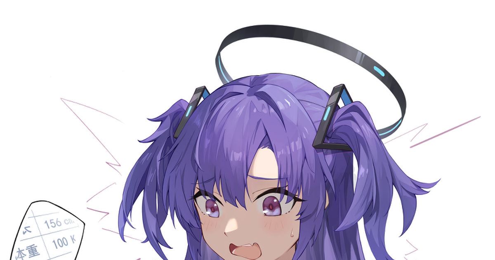

# Popup

-- html nya ---

<!DOCTYPE html>
<html lang="en">
<head>
     <meta charset="UTF-8">
     <meta name="viewport" content="width=device-width, initial-scale=1.0">
     <meta http-equiv="X-UA-Compatible" content="ie=edge">
     <title>Document</title>
     
</head>
<body>
     

          Lorem ipsum dolor sit amet, consectetur adipisicing elit. Nisi deleniti, quibusdam inventore nulla sit recusandae unde enim ipsum dolorum, voluptates illo in, iure quos debitis modi rem. Eligendi magni vel velit expedita omnis, ab illum non adipisci odio rem itaque facilis aliquam totam ut obcaecati quaerat laboriosam, maiores voluptates. Facilis, molestias accusamus sed pariatur quidem reprehenderit perspiciatis asperiores ad tenetur vel voluptatum, porro quae magnam suscipit repellat blanditiis tempore, expedita. Nobis tenetur dicta architecto animi sint distinctio obcaecati amet blanditiis impedit, illo praesentium libero laborum. Ratione voluptates consectetur beatae, atque, sequi ab recusandae, porro ducimus ipsam consequuntur vero! Dignissimos, suscipit.
     

     <section>
          

               <h1>X</h1>
               
               

                    Perhatian!
               

               

                    Saat ini bot sedang mengalami lonjakan user yang terlalu tinggi, sementara semua fitur dikunci dan hanya dapat digunakan oleh member Premium dan VIP
               

               <ul>
                    <li>
                         Premium: 10K/Bulan
                    </li>
                    <li>
                         Grup VIP: 20K/Bulan/Grup
                    </li>
                    <li>
                         Ketik !premium di nomor bot untuk memesan
                    </li>
               </ul>
          

     </section>
     <button>Click Guwe</button>
     
</body>
</html>
